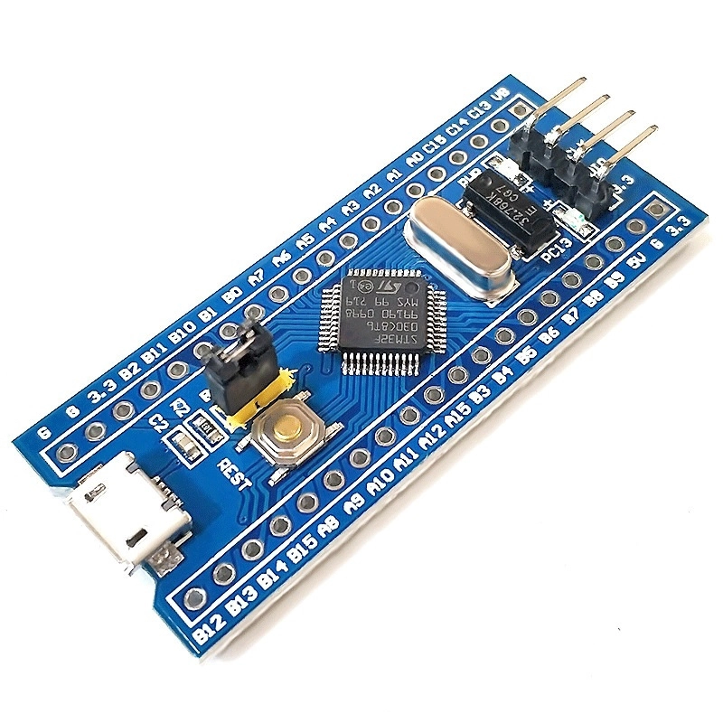

<p align="center">
  
</p>

# MCU Bare-Metal

Bare-metal programming examples for ARM Cortex-M microcontrollers using the STM32F103C8T6 Blue Pill.

<p align="center">
  
</p>

This repository focuses on understanding firmware below high-level abstractions, including compiler startup, linker scripts, Cortex-M features, memory-mapped registers, CMSIS Device, and STM32 HAL.

The examples intentionally keep the application behavior simple so that each step focuses on one new firmware concept.

## Demo

The examples use the onboard PC13 LED on the STM32F103C8T6 Blue Pill.

```text
PC13 LOW  = LED ON
PC13 HIGH = LED OFF
```

Hardware demo videos are included in the README of each example directory.

## Architecture

```text
+------------------------------------------------------------+
| APPLICATION                                                |
|                                                            |
| main()                                                     |
| interrupt handlers                                         |
| GPIO control                                               |
| timing logic                                               |
+------------------------------------------------------------+
                           |
                           v
+------------------------------------------------------------+
| SOFTWARE ABSTRACTION                                       |
|                                                            |
| Raw Registers                                              |
| Register Structs                                           |
| CMSIS Device                                               |
| STM32 HAL                                                  |
+------------------------------------------------------------+
                           |
                           v
+------------------------------------------------------------+
| STARTUP                                                    |
|                                                            |
| Vector Table                                               |
| Reset_Handler                                              |
| .data initialization                                       |
| .bss initialization                                        |
+------------------------------------------------------------+
                           |
                           v
+------------------------------------------------------------+
| HARDWARE                                                   |
|                                                            |
| ARM Cortex-M3                                              |
| SysTick                                                    |
| RCC                                                        |
| GPIO                                                       |
| Flash                                                      |
| SRAM                                                       |
+------------------------------------------------------------+
```

## Hardware

| Item | Configuration |
|---|---|
| MCU | STM32F103C8T6 |
| Core | ARM Cortex-M3 |
| Board | Blue Pill |
| Flash | 64 KB |
| SRAM | 20 KB |
| Onboard LED | PC13 |
| Debugger | ST-LINK/V2 |
| Debug interface | SWD |

## Development Environment

| Tool | Purpose |
|---|---|
| GNU Arm Embedded GCC | Compile and link ARM firmware |
| GNU Make | Build automation |
| OpenOCD | Flash and debug |
| ST-LINK/V2 | SWD debugger and programmer |
| Git | Version control |
| Linux | Development environment |

## Topics

### compiler/

| Folder | Concept |
|---|---|
| [00-startup-c](compiler/00-startup-c/) | Custom vector table, Reset_Handler, linker script, .data and .bss initialization |

### arm-cortex-m/

| Folder | Concept |
|---|---|
| [00-systick](arm-cortex-m/00-systick/) | Cortex-M3 SysTick interrupt and 1 ms system tick |

### hal-pattern/

| Folder | Concept |
|---|---|
| [00-register-macro](hal-pattern/00-register-macro/) | Direct memory-mapped register access using C macros |
| [01-register-struct](hal-pattern/01-register-struct/) | Peripheral register access using C structures |
| [02-cmsis-device](hal-pattern/02-cmsis-device/) | CMSIS Core and STM32F1 CMSIS Device definitions |
| [03-hal-blocking](hal-pattern/03-hal-blocking/) | STM32 HAL with blocking HAL_Delay |
| [04-hal-nonblocking](hal-pattern/04-hal-nonblocking/) | STM32 HAL with non-blocking HAL_GetTick timing |

### peripheral/

| Folder | Concept |
|---|---|
| [00-gpio-input](peripheral/00-gpio-input/) | GPIO input polling using PA0 and PC13 |

## Abstraction Progression

The HAL pattern examples show the same hardware operation at different abstraction levels.

```text
Memory-Mapped Register
        |
        v
Register Macro
        |
        v
Register Struct
        |
        v
CMSIS Device
        |
        v
STM32 HAL
```

### Register Macro

```c
#define RCC_APB2ENR \
    (*(volatile uint32_t *)0x40021018U)

RCC_APB2ENR |= (1U << 4U);
```

### Register Struct

```c
RCC->APB2ENR |= (1U << 4U);
```

### CMSIS Device

```c
RCC->APB2ENR |= RCC_APB2ENR_IOPCEN;
```

### STM32 HAL

```c
__HAL_RCC_GPIOC_CLK_ENABLE();
```

All four methods ultimately enable the same GPIOC peripheral clock.

## Blocking and Non-Blocking Timing

Blocking timing:

```c
HAL_Delay(500U);
```

During the delay, the program waits until the requested time has elapsed.

Non-blocking timing:

```c
if ((uint32_t)(HAL_GetTick() - last_toggle) >= 500U)
{
    last_toggle = HAL_GetTick();

    /* Update LED */
}
```

The main loop continues running while time is being measured.

This allows other application logic to run in the same loop.

```c
while (1)
{
    check_led();
    check_button();
    check_uart();
    check_sensor();
}
```

## Repository Structure

```text
mcu-bare-metal/
|
+-- compiler/
|   +-- 00-startup-c/
|
+-- arm-cortex-m/
|   +-- 00-systick/
|
+-- hal-pattern/
|   +-- 00-register-macro/
|   +-- 01-register-struct/
|   +-- 02-cmsis-device/
|   +-- 03-hal-blocking/
|   +-- 04-hal-nonblocking/
|   +-- README.md
|
+-- peripheral/
|   +-- 00-gpio-input/
|   +-- README.md
|
+-- resources/
|   +-- CMSIS/
|   +-- STM32F1xx_HAL_Driver/
|
+-- .gitignore
+-- README.md
```

## Quick Start

Clone the repository:

```bash
git clone https://github.com/TrieuHzang/mcu-bare-metal.git

cd mcu-bare-metal
```

Go to an example:

```bash
cd hal-pattern/00-register-macro
```

Build:

```bash
make
```

Flash with ST-LINK:

```bash
make flash
```

Generate disassembly:

```bash
make disasm
```

Remove generated files:

```bash
make clean
```

## Build Flow

```text
C Source
   |
   v
arm-none-eabi-gcc
   |
   v
Object Files
   |
   +-- Linker Script
   |
   v
ELF Firmware
   |
   +-- objcopy
   |
   v
BIN Firmware
   |
   v
OpenOCD
   |
   v
ST-LINK/V2
   |
   v
STM32F103C8T6
```

## Startup Flow

```text
Power / Reset
      |
      v
Vector Table
      |
      +-- Initial MSP
      |
      v
Reset_Handler
      |
      +-- Copy .data from Flash to SRAM
      |
      +-- Clear .bss
      |
      v
main()
```

## Memory Map

```text
FLASH
0x08000000
|
+-- Vector Table
+-- .text
+-- .rodata
+-- Initial .data values


SRAM
0x20000000
|
+-- .data
+-- .bss
+-- Free RAM
+-- Stack
|
0x20005000
```

The initial Main Stack Pointer is placed at the top of SRAM:

```text
0x20000000 + 0x5000 = 0x20005000
```

## Resources

The repository contains the required CMSIS and STM32F1 HAL components under:

```text
resources/
|
+-- CMSIS/
|
+-- STM32F1xx_HAL_Driver/
```

These resources are used by the CMSIS Device and STM32 HAL examples.

## Current Status

Software build and ELF verification are complete for the current examples.

```text
compiler/
+-- 00-startup-c

arm-cortex-m/
+-- 00-systick

hal-pattern/
+-- 00-register-macro
+-- 01-register-struct
+-- 02-cmsis-device
+-- 03-hal-blocking
+-- 04-hal-nonblocking
```

Hardware verification for the newer HAL pattern examples will be completed when the Blue Pill hardware is available.

## References

- STM32F103x8 STM32F103xB Datasheet
- RM0008 STM32F1 Reference Manual
- ARM Cortex-M3 documentation
- CMSIS Core
- STM32F1 CMSIS Device
- STM32F1xx HAL Driver
- GNU Arm Embedded Toolchain
- OpenOCD

## Contact & Support

**Trieu Ha Giang** - Embedded Systems Engineering Student

```text
Thank you for visiting this repository.
If you have any questions or feedback about the system design, embedded firmware, or hardware integration, feel free to reach out directly.
```

**My contact:**

[](mailto:trieuhagiang1312@gmail.com)
[](https://github.com/TrieuHzang)
[](https://www.linkedin.com/in/haazangg/)
